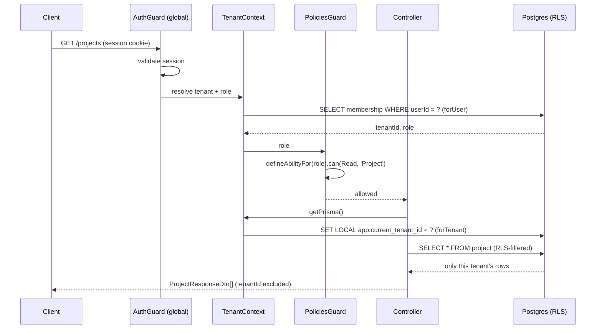

# Architecture

How a request actually flows through {{projectName}}'s auth → tenancy → RBAC → data access
stack — read this before touching `api/src/`.

## The request lifecycle

1. **Auth** — Better Auth (`api/src/auth/auth.ts`) owns session cookies under `basePath: '/auth'`.
   `@thallesp/nestjs-better-auth`'s global `AuthGuard` requires a valid session on every route by
   default; routes that must stay public (health checks, the Stripe webhook) opt out explicitly
   with `@AllowAnonymous()`.
2. **Tenancy** — Once authenticated, `TenantContext` (`api/src/tenancy/tenant-context.ts`,
   request-scoped) resolves which tenant the caller belongs to via
   `Membership.findFirst({ where: { userId } })`. A user with more than one membership always
   resolves to their oldest one — switching tenants isn't built (see "Known gaps" below).
3. **RBAC** — `PoliciesGuard` (`api/src/casl/policies.guard.ts`) checks `@CheckPolicies()` against
   ability rules from `packages/shared/src/casl/ability.factory.ts`, using the role `TenantContext`
   just resolved. The guard is itself request-scoped (`@Injectable({ scope: Scope.REQUEST })`) —
   see the comment on it for why that's required, not optional, given it depends on
   `TenantContext`. The same ability rules are imported unmodified by the frontend
   (`app/src/lib/use-ability.ts`), so the UI can't drift from what the API actually enforces.
4. **Data access** — Inside a controller, every query on a tenant-scoped table goes through
   `TenantContext.getPrisma()`, which wraps the query in a transaction that sets a Postgres session
   variable. Row-level security policies (the `enable_rls` migration) check that variable and
   silently filter out every other tenant's rows — enforced at the database level, not just by
   application code remembering to add a `WHERE tenantId = ...` clause.

## Diagram

## Why row-level security, not just an application-level filter

A Prisma Client Extension (`forTenant()`) already injects the tenant scope automatically, so in
practice a developer would have to go out of their way to write an unscoped query. RLS exists as a
*second*, independent layer underneath that: it enforces the same rule at the database connection
level, so a bug in application code (a forgotten `getPrisma()`, a raw query, a future ORM swap)
fails closed — the database itself returns zero rows for another tenant, not a data leak. This is
why the runtime app connects as a limited, non-superuser role (`APP_DATABASE_URL`, `app_role`) and
never as the migration-only superuser (`DATABASE_URL`) — Postgres superusers unconditionally bypass
RLS, which would silently make the whole second layer a no-op.

## Known gaps

- **No tenant switching.** A user in more than one tenant always resolves to their oldest
  membership (`TenantContext`'s own doc comment). Switching between memberships isn't built.
- **No invite-a-teammate flow.** Every tenant currently has exactly one user — its `owner`, created
  at signup. Adding a second member to an existing tenant has to be done manually (e.g. inserting a
  `membership` row directly) until this is built.
- **Billing has no FE pages.** `POST /billing/checkout`/`POST /billing/portal` exist and work, but
  there's no frontend UI calling them yet (see `docs/product-scope.md` §7.4 vs §7.6 — only
  `Projects` calls for FE pages in v1).
