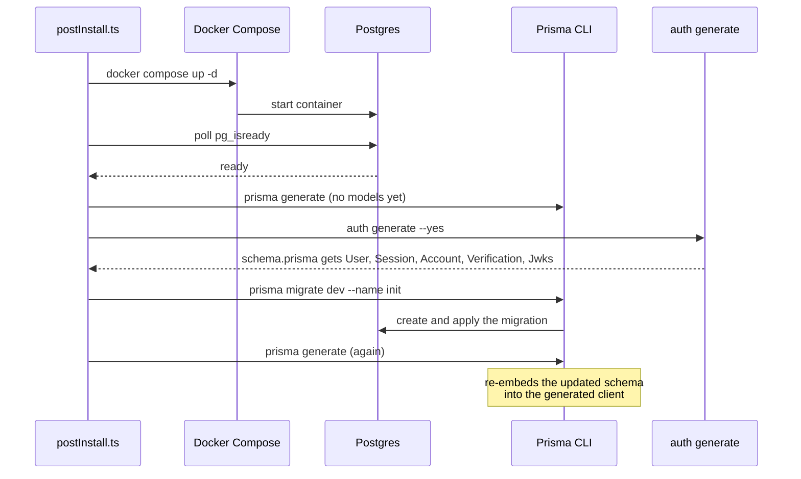

# Case study: wiring up authentication

The bundle's `postInstall.ts` is where the interesting orchestration happens: it has to bring up a
real database, generate a Prisma client that doesn't exist yet, let Better Auth's own CLI extend
the schema, migrate, and regenerate — in an order where getting any step out of place produces a
failure that looks nothing like its real cause.

Two of these five steps exist purely to work around real bugs (see
[Lessons learned](/lessons)) — the initial `prisma generate` before `auth generate`, and the final
one after `migrate dev`.

## Verified live, not just read

The whole thing was verified against a real, running system — not just by reading the code:

1. **Signup** — `POST /auth/sign-up/email`
2. **Email verification** — via a console-logged stub link, since there's no real email provider
   wired yet
3. **Login** — `POST /auth/sign-in/email`, blocked until step 2 completes
4. **Session cookie** — set on login, resolved on every subsequent request
5. **A protected route** — guarded by the global `AuthGuard`, rejecting requests with no session
6. **`/health` staying public** — despite the global guard, via an explicit `@AllowAnonymous()`
   injection
7. **A JWT minted by the optional plugin** — `GET /auth/token`, only present when `jwt-plugin` is
   selected

All seven, against a real Postgres container, through the actual `postInstall.ts` code path — not
a simulation of it.

## What the recipe actually contains

- `files/docker-compose.yml` — a `postgres:16-alpine` service with a healthcheck
- `files/api/prisma.config.ts` + `files/api/prisma/schema.prisma` — Prisma 7's config split (see
  [Lessons learned](/lessons) for why the connection URL isn't in `schema.prisma` anymore)
- `files/api/src/prisma/prisma.service.ts` + `prisma.module.ts` — a NestJS-managed
  `PrismaService`, `@Global()` so it's injectable anywhere
- `files/api/src/auth/auth.ts` — the Better Auth server instance: Prisma adapter, email+password
  with `requireEmailVerification: true`, console-log stub callbacks for verification/reset email,
  and a `plugins` marker for `jwt-plugin` to extend
- `files/api/src/auth/current-user.decorator.ts` — `@CurrentUser()`, reading `request.session.user`
  the same way the auth package's own `@Session()` decorator does internally
- `inject/` snippets wiring `AuthModule`/`PrismaModule` into `app.module.ts`, `bodyParser: false`
  into `main.ts` (Better Auth needs the raw request body), `@AllowAnonymous()` onto `/health`, and
  the Prisma-generated-client path into `.gitignore`
