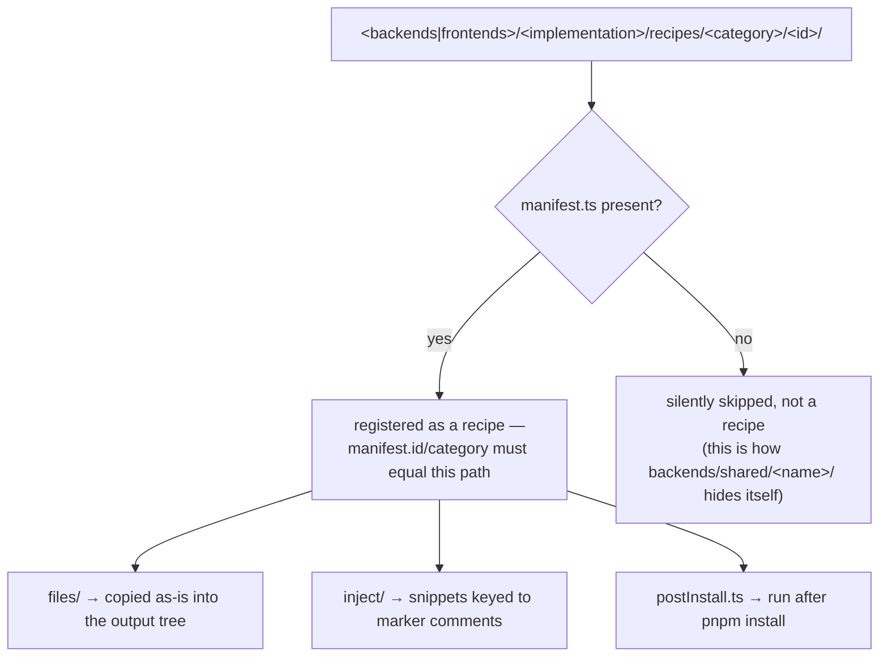
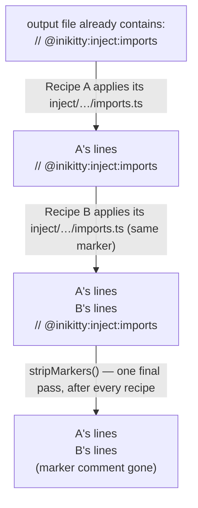
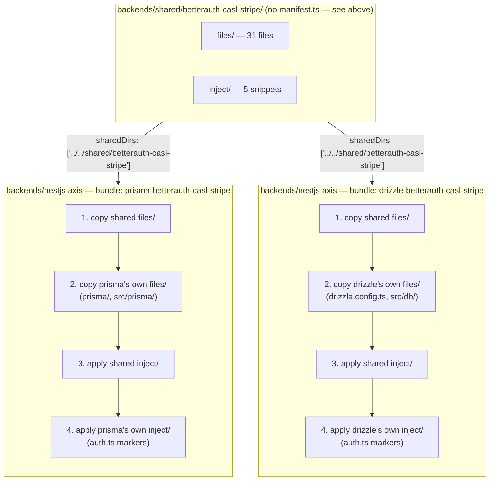

# Authoring a recipe

A walkthrough for contributors adding a **new** recipe, aimed at the question "I want to add
support for X — where do I even start?" [Recipes & bundles](/recipes) covers what already ships;
this page covers how to add to it.

## First: bundle or category?

- **Bundle** — pick this only if your addition is *integration-coupled* with the existing bundle
  choice (a new ORM, a new auth provider) such that it has to be tested as one unit with tenancy/RBAC
  wiring. Exactly one bundle is ever selected; see [why bundles don't split further](/recipes#why-bundles-don-t-split-further).
- **Category** — everything else. Independent, freely mixable, selected zero-or-more at a time.
  Almost everything you'll want to add is a category recipe.

## Tooling

Five `pnpm` commands exist specifically to support the workflow below — they're referenced inline
where relevant, but here's the full list up front:

| Command | Does |
|---|---|
| `pnpm new-recipe (--backend \| --frontend) <id> <category> <id>` | Scaffolds `<kind>/<implementation>/recipes/<category>/<id>/manifest.ts`, pre-filled with every field commented out. |
| `pnpm check-recipes` | Validates every discovered manifest across every backend and frontend tree: dangling `conflicts`/`requires`/`requiresAnyOf` references, cross-recipe dependency-version mismatches, `envVars` key collisions. |
| `pnpm check-recipe-duplication` | Flags byte-identical files across two different recipes' own `files/`/`inject/` trees, anywhere in the repo — the check that would have caught the duplication `sharedDirs` (below) now solves. |
| `pnpm dry-run [--backend <id>] [--bundle <id>] [--frontend <id>] [--frontend-categories a,b]` | Generates a selection into a disposable temp directory, prints the file list, cleans up after itself (`--keep` to leave it on disk). |
| `pnpm list-markers [--backend <id>] [--bundle <id>] [--frontend <id>]` | Lists every marker available to inject into for a given selection, without running `generate()`. |

## Before you start: what a recipe can and can't do

A recipe layers files onto one implementation's own `base/` — backend and frontend are
independently pluggable axes (`backends/nestjs/`, `frontends/react-vite/` today; see
`docs/product-scope-phase-2.md` for the design), each with its own fixed skeleton
(NestJS + TypeScript for the one shipped backend, Vite + React for the one shipped frontend). A
recipe can add files anywhere in its own axis's output tree, graft code into files its own axis's
base template or another recipe already wrote (via markers), and run a setup script after install.
**It cannot change what language or framework its own axis's base template is written in** — a
recipe under `backends/nestjs/recipes/` can't make that backend anything other than NestJS. If your
idea genuinely needs a different backend language or framework, that's a new entry under
`backends/` (or `frontends/`) — a bigger, separate undertaking than authoring a recipe, since it
means writing a whole new `base/` — not something a recipe inside an existing implementation can
express. See `docs/product-scope-phase-2.md` for what that involves.

## The contract

```
<backends|frontends>/<implementation>/recipes/<category>/<id>/
  manifest.ts     # exports `manifest: RecipeManifest`
  files/          # copied as-is, mirroring the output layout
  inject/         # snippets keyed to marker comments in files that already exist
  postInstall.ts  # optional: default-exports (ctx) => Promise<void>, run after pnpm install
```

`id` and `category` in `manifest.ts` must match the folder you put it in — `discoverRecipes()`
throws otherwise. Everything past that is optional; a recipe with just `files/` and a two-field
manifest is completely valid (see `backends/nestjs/recipes/ai-format/claude-code` for the smallest
real example shipped today).

`discoverRecipes()` is called once per axis (once for whichever backend is selected, once for
whichever frontend is selected — see `generateMultiAxis` in `src/engine/apply.ts`), and each call
only ever walks exactly two levels deep under that axis's own `recipes/`, looking for one file:



That "no manifest.ts → skipped" branch is the entire mechanism `sharedDirs` fragments rely on — a
`shared/<name>/` folder sitting alongside an axis's real implementations (e.g. `backends/shared/`)
isn't special-cased anywhere in the engine, it's just a folder that fails the `manifest.ts present?`
check, so it's invisible to `discoverRecipes()` and only ever reached by a recipe explicitly listing
it in `sharedDirs`. See [sharedDirs below](#when-to-reach-for-shareddirs).

### `manifest.ts` field reference

| Field | Required | Does |
|---|---|---|
| `id`, `category` | yes | Identity; must match the folder path. `id` is what `--bundle`/`requires`/`conflicts`/folder names use — keep it stable. |
| `label` | no | Short display name for the CLI's selection prompt (`p.select`'s `label`) — falls back to `id` if omitted. Use this instead of renaming `id` when a recipe's id is accurate but long (e.g. `id: 'prisma-betterauth-casl-stripe'`, `label: 'Prisma'`). |
| `description` | no | Longer summary; shown as the CLI prompt's hint text alongside `label`, and in docs. |
| `conflicts` | no | Recipe ids that can't be selected alongside this one. |
| `requires` | no | Recipe ids that **all** must be selected too (AND). |
| `requiresAnyOf` | no | Recipe ids where **at least one** must be selected (OR) — use this instead of `requires` when you depend on "some bundle with property X" rather than one specific id (see `jwt-plugin`, which needs *some* Better-Auth bundle, not specifically the Prisma one). |
| `sharedDirs` | no | Paths, relative to this tree's own `recipesDir`, to a `shared/<name>/` fragment *within the same axis* (same `files/`+`inject/` shape as a recipe root) applied *before* this recipe's own — for content that's genuinely identical across more than one recipe. See below. |
| `packageJsonPatch.api` / `.app` | no | Merged into `api/package.json` / `app/package.json` — `dependencies`, `devDependencies`, `scripts`, `jestModuleNameMapper`. Only touches those two files; a recipe that ships a non-Node service (like the Java example below) has nothing to put here. |
| `envVars` | no | `{ key, example, description? }` entries appended at `.env.example`'s marker. |

None of this is enforced by a schema beyond TypeScript's own types — `RecipeManifest` in
`src/engine/types.ts` is the source of truth if this table and the code ever disagree.

### Naming your recipe

- **`id` is the technical name — folder, `--bundle`/`pnpm dry-run --bundle` value, and the exact
  string every other recipe's `conflicts`/`requires`/`requiresAnyOf` references.** Changing it
  later means a real rename: the folder, plus every reference to it across the codebase and docs.
  Pick it once and keep it stable; don't rename for cosmetic reasons.
- **`label` is what a human actually sees** — the CLI's selection prompt shows `label` (falling
  back to `id`). Keep `label` short no matter how long or precise `id` needs to be; this is what
  decouples the two, so use it rather than trying to shorten `id` itself.
- **Bundle ids today are compound stack fingerprints** (`<orm>-<auth>-<rbac>-<billing>`, e.g.
  `prisma-betterauth-casl-stripe`) — self-documenting, and cheap to keep doing *because only one
  axis (the ORM) currently varies between bundles*. If a new bundle varies more than one axis from
  an existing one, don't invent an abbreviation scheme for it — spell it out. `label` already
  absorbs the cost of a long `id`; a descriptive id is more useful to a contributor grepping
  `requires: [...]` than a short opaque one would be.
- **`category` is a free-form folder name, not a fixed enum** — `discoverRecipes()` never
  validates it against a list (`workers` in the worked example below didn't exist before this
  page was written). Pick a clear noun for what you're adding; don't try to pre-design a taxonomy
  for categories that don't exist yet.
- **What a bundle `id` can't grow into: a different base stack.** A bundle can only vary pieces
  that plug into its own axis's fixed `base/` (see [what a recipe can and can't do](#before-you-start-what-a-recipe-can-and-can-t-do)
  above) — a bundle under `backends/nestjs/recipes/` can't encode "this bundle generates a Java
  backend instead." Supporting a genuinely different backend or frontend is a new entry under
  `backends/`/`frontends/`, not a bundle — see `docs/product-scope-phase-2.md`.
- **Give equivalent bundles across backends the same `id`/`label`.** If a second backend
  implements the identical contract as an existing one (e.g. `backends/express/recipes/bundle/prisma-betterauth-casl-stripe/`
  alongside `backends/nestjs/recipes/bundle/prisma-betterauth-casl-stripe/`), reuse the exact same
  id — there's no collision risk, since each lives in its own `recipesDir` and is never discovered
  together. This is what lets a frontend recipe's `requiresAnyOf` mean "whichever backend
  implements this contract" with one id, instead of enumerating every backend by name.

### Reusing an existing marker vs. adding your own

If the file you need to extend already has a `// @inikitty:inject:<name>` marker — run
`pnpm list-markers --bundle <id>` (add `--backend`/`--frontend` if there's more than one
implementation for that axis) rather than grepping by hand — just add a snippet at
`inject/<path>.inject/<name>.<ext>`; see [the generation pipeline](/pipeline#grafting-code-into-a-file-you-don-t-own)
for the exact mechanics. If it doesn't have one yet, adding a one-line marker comment to that file
is a normal, small part of extending it for a new integration point — plenty of existing markers
(`agents-sections`, `learn-more-links`) were added exactly this way when a later recipe needed them.

The path *is* the instruction — `inject/<targetRelPath>.inject/<markerName>.<ext>` says exactly
which file and which marker, resolved against that **axis's own output tree** (or a root-level
file — see below), not against anything sitting next to it in the recipe folder. A snippet under
`backends/shared/betterauth-casl-stripe/inject/api/src/app.controller.ts.inject/imports.ts` targets
`backends/nestjs/base/api/src/app.controller.ts` — there's no `app.controller.ts` anywhere near
that snippet on disk, and there doesn't need to be. A recipe can also target a *root-level* file
(`AGENTS.md`, `README.md`, `.env.example`) copied once from `templates/root/` before either axis
runs — that's how a backend recipe and a frontend recipe can both contribute to the same `AGENTS.md`
marker across the two independent `generateMultiAxis()` calls. When more than one recipe targets
the same marker, snippets stack in application order, always directly above the still-live marker
line, until one final pass removes it — after *every* axis's recipes have run, not once per axis
(see `finalizeOutput` in `src/engine/apply.ts`):



### When to reach for `sharedDirs`

Only when a file is **byte-for-byte identical** across every recipe that would ship it, for a real
structural reason — not because two files happen to look similar today. `backends/shared/betterauth-casl-stripe/`
is the real example: 31 files (the CASL guard, the billing controller, the DTOs) are identical
between the Prisma and Drizzle bundles because none of them touch the ORM directly. (The FE pages
that used to live in this same shared fragment moved out entirely once frontend became its own
axis — see `docs/product-scope-phase-2.md` — they're now
`frontends/react-vite/recipes/pages/betterauth-casl-stripe-pages/`, a `sharedDirs` frontend-side
sibling isn't needed since there's only one frontend today.) If a file is *mostly* the same with one
recipe-specific line, don't force it into a shared fragment with a marker carved out of it — that
fragments a small file into unreadable pieces for no real win. Leave it as separate, complete
copies instead. Run `pnpm check-recipe-duplication` after adding a recipe — it flags exactly this
situation across every recipe pair in the repo, not just the one you're thinking about.

There's exactly one copy on disk; each bundle's own `manifest.ts` just references it, and at
generate time the shared content is copied/injected *before* that bundle's own — same ordering
whichever bundle you picked, since only one bundle is ever resolved per backend axis:



::: info Never both at once
`PB` and `DB` above are two separate resolutions of the same `backends/nestjs` axis, never both —
`resolveRecipes()` allows exactly one `bundle`-category recipe per axis per run. The diagram shows
both only to make the point that they draw from the same source; a single generated project only
ever goes through one of these paths.
:::

## Testing what you add

- Run `pnpm check-recipes` first — it catches manifest mistakes (a typo'd `requires` id, a
  dependency version that collides with another recipe) before you've written a single test.
- `pnpm dry-run --bundle <id> --backend-categories your-new-id` (or `--frontend-categories`, if
  your recipe is frontend-side) to see the actual file list a selection including your recipe
  produces, without a full install/migration cycle.
- Add (or extend) a fixture under `tests/fixtures/recipes/` (single-axis) or
  `tests/fixtures/multi-axis/` (cross-axis behavior) and assert resolution/injection behavior in
  `tests/unit/` — these use a small fake recipe set on purpose, so they don't churn as real
  recipes change.
- Add your recipe's id to a selection in `tests/smoke/real-template.test.ts`, which exercises the
  *real* `templates/root/` + `backends/nestjs/` + `frontends/react-vite/` trees (file shape and
  injected content only — no install, no network).
- If it's a **bundle**, `scripts/list-backend-bundles.ts` picks it up automatically for the CI
  `golden-path` matrix — no workflow changes needed. If it's a **category** recipe with a
  `postInstall.ts` that needs real verification (network calls, a non-Node toolchain), that
  verification is manual; say so in the relevant axis's `recipes/README.md` gotchas (e.g.
  `backends/nestjs/recipes/README.md`) rather than pretending CI covers it.
- Run `pnpm typecheck && pnpm lint && pnpm test` before opening a PR.

## Worked example: a Java service, as a category recipe

Taking "I want to add Java" literally and steering it into something the architecture actually
supports: not a new backend language for the API (see above), but a **standalone Java service that
runs alongside it** — say, a report-generation worker the NestJS API calls over HTTP. This exercises
every part of the contract above.

### 1. Scaffold the folder

```
pnpm new-recipe --backend nestjs workers java-report-worker --description "Adds a standalone Java report-worker service."
```

`workers` isn't a category that exists yet — that's fine, a category is just a folder name;
`discoverRecipes()` doesn't validate it against a fixed list. This writes `manifest.ts` (filled in
next); `files/`, `inject/`, and `postInstall.ts` get added by hand as needed:

```
backends/nestjs/recipes/workers/java-report-worker/
  manifest.ts
  files/
    services/report-worker/pom.xml
    services/report-worker/src/main/java/com/example/reportworker/ReportWorkerApplication.java
  inject/
    docker-compose.yml.inject/
      services.yml
  postInstall.ts
```

### 2. `manifest.ts`

```ts
import type { RecipeManifest } from '../../../../../src/engine/types.js';

export const manifest: RecipeManifest = {
  id: 'java-report-worker',
  category: 'workers',
  description:
    'Adds a standalone Java (Maven) service under services/report-worker/, wired into ' +
    'docker-compose.yml, that the API can call for report generation. Runs alongside the ' +
    "NestJS API and React app — doesn't replace either.",
  // docker-compose.yml only exists when a bundle wrote it — this recipe needs a place to add its
  // service to, not a specific ORM, so requiresAnyOf rather than hardcoding one bundle id.
  requiresAnyOf: ['prisma-betterauth-casl-stripe', 'drizzle-betterauth-casl-stripe'],
  envVars: [
    {
      key: 'REPORT_WORKER_URL',
      example: 'http://localhost:8080',
      description: 'Base URL of the Java report-worker service',
    },
  ],
};
```

No `packageJsonPatch` — this recipe adds no Node dependency to `api/` or `app/`, so that field is
just omitted, not set to an empty object.

### 3. `inject/docker-compose.yml.inject/services.yml`

```yaml
  report-worker:
    build: ./services/report-worker
    ports:
      - '8080:8080'
```

This targets a `# @inikitty:inject:services` marker under `docker-compose.yml`'s `services:` key.
As of today that marker doesn't exist — `backends/shared/betterauth-casl-stripe/files/docker-compose.yml`
only has a `postgres` service and no injection point. Adding it (one comment line, in the same PR)
is the normal way this grows; injection doesn't care which recipe originally shipped the target
file, only that it exists in the output tree by the time injections run — which every file, from
every recipe *in this axis*, already does by then (see [the generation pipeline](/pipeline)).

### 4. `postInstall.ts`

```ts
import type { PostInstallFn } from '../../../src/engine/types.js';

const postInstall: PostInstallFn = async () => {
  console.log(
    '\n[java-report-worker] Build the Java service before starting it:\n' +
      '  cd services/report-worker && mvn -q package\n',
  );
};

export default postInstall;
```

`postInstall.ts` runs in a plain Node context — it can shell out, but it can't assume a JDK or Maven
is installed on the machine running `create-inikitty`. Printing next steps instead of trying to
auto-build is the same call already made for the auth bundle's email delivery (a `console.log` stub
— see [Lessons learned](/lessons)): don't silently assume a toolchain the generator can't verify.

### What this recipe deliberately doesn't do

It doesn't touch `backends/nestjs/base` or `frontends/react-vite/base` — the NestJS API and React
app are unaffected whether or not this recipe is selected. It doesn't need `sharedDirs` — nothing
about it is duplicated across another recipe. And it doesn't try to make the *API itself* Java —
that would mean a whole new `backends/java/` entry with its own `base/`, a much bigger undertaking
than a recipe (see [Before you start](#before-you-start-what-a-recipe-can-and-can-t-do) above),
not something a recipe inside `backends/nestjs/` can express.
