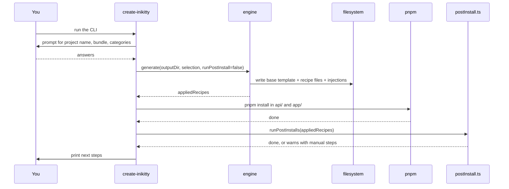

# A full CLI run

## From `create-inikitty` to a running app

The CLI is a thin wrapper: it prompts, calls the engine, shells out to `pnpm`, then calls the
engine again for postInstall. Nothing about project generation lives in `cli.ts` itself — it's all
delegation.

::: warning The CLI isn't scriptable
The prompts are a real TUI (`@clack/prompts`) and don't work with piped, non-TTY stdin. For
programmatic generation — tests, manual verification — call `generate()` / `runPostInstalls()`
from `src/index.ts` directly instead of shelling out to the CLI binary.
:::

## Next: see it applied to a real recipe

The [auth recipe case study](/auth-recipe) walks through exactly what happens inside
`runPostInstalls()` when the golden-path bundle is selected — bringing up Postgres, generating a
Prisma client, and wiring Better Auth, all from that one `postInstall.ts` call.
