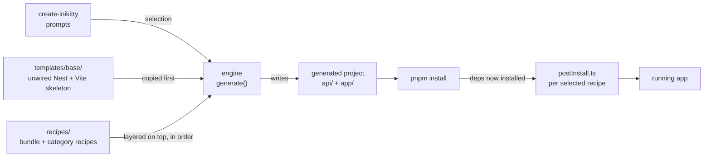

# How Inikitty Works

Inikitty is a scaffolding CLI that assembles a working SaaS starter from a plain base template
plus a stack of **recipes**. This is a tour of the machinery underneath `create-inikitty` — the
engine that does the assembling, the marker system recipes use to graft code into files they
don't own, and the real failures hit (and fixed) while wiring up the first recipe end to end.

| | |
|---|---|
| **Engine modules** | 8 |
| **Recipes shipped** | 2 |
| **Tests** | 21, all green |
| **Node required** | ≥22, for the auth recipe |

## Two codebases, one engine

This repository is the **generator**. It is not the app your users end up running — it's the tool
that writes that app to disk. Everything under `src/` exists to answer one question: given a
project name and a set of selected recipes, what files should end up in the output directory, in
what shape?

The engine never hardcodes knowledge of Prisma, Better Auth, or anything else product-specific. It
only knows how to discover recipes, read their manifests, and apply them to a base template in a
fixed order. Every stack-specific decision lives in `templates/base/` (the unwired skeleton) or
`recipes/` (the opt-in layers) — never in `src/engine/`.

The generator reads two sources on disk (the base template and the selected recipes) and writes
one output directory; everything after that is normal tooling — install, then per-recipe setup.

## Where to go next

- **[Recipes & bundles](/recipes)** — the folder contract every recipe follows, and what's
  actually shipped today
- **[The generation pipeline](/pipeline)** — the exact, order-sensitive sequence `generate()` runs,
  and the marker-injection mechanism recipes use to extend files they don't own
- **[A full CLI run](/cli-flow)** — from `create-inikitty` to a running app, end to end
- **[Case study: wiring up authentication](/auth-recipe)** — what the auth bundle's `postInstall.ts`
  actually does, verified live against a real Postgres
- **[Lessons learned](/lessons)** — five real bugs found only by actually running the generated
  project, not by reading the code
- **[Module map](/reference)** — a quick-reference table of every file under `src/engine/`

This site is a snapshot of the engine and the auth slice of `bundle/prisma-betterauth-casl-stripe`.
`CLAUDE.md` and `recipes/README.md` in the main repo are the living documentation — they'll drift
ahead of this site as tenancy, RBAC, and billing get built. `docs/product-scope.md` is the original
product spec this whole thing is being built against.
