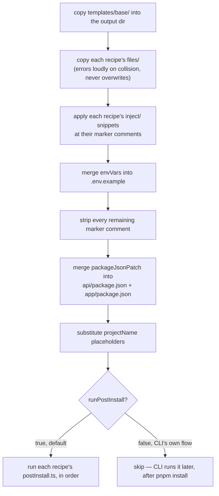

# The generation pipeline

## What `generate()` actually does, in order

`src/engine/apply.ts` is the orchestrator. Every step below runs in this exact sequence, and the
order isn't arbitrary — two of these steps only work because they run before the step that would
otherwise erase what they need.



::: tip Why envVars merge before markers get stripped
`envVars` merge before markers get stripped, because the merge target *is* a marker comment in
`.env.example` — strip first and there's nothing left to merge into.
:::

::: info Why runPostInstall defaults true but the CLI sets it false
`generate()` running its own postInstall step is the right default for a recipe whose setup has no
install dependency. But this bundle's postInstall runs `prisma` and `auth` — binaries that don't
exist until `pnpm install` has happened. `src/cli.ts` now calls
`generate({ runPostInstall: false })`, runs `pnpm install` in `api/` and `app/`, and only then
calls `runPostInstalls()` itself. Getting this backwards was the first real bug found while
building the auth recipe — see [Lessons learned](/lessons).
:::

## Grafting code into a file you don't own

A recipe often needs to add a line to a file the *base template* shipped — register a module in
`app.module.ts`, add an option to `main.ts`'s bootstrap. Rather than patching TypeScript syntax
trees, the engine uses plain marker comments and a folder-naming convention that encodes both the
target file and the marker name in the snippet's own path.

`// @inikitty:inject:<name>` in a target file pairs with a snippet at
`inject/<targetPath>.inject/<name>.ts`.

The snippet's directory is the target file's relative path with `.inject` appended; the filename
(minus extension) is the marker name. `inject.ts` splices the snippet's contents in directly above
the matching marker line, and `stripMarkers()` removes every marker comment once all recipes have
run.

### A real example

The base template's `app.module.ts` ships two markers. The auth bundle supplies one snippet per
marker:

::: code-group

```ts [templates/base/api/src/app.module.ts]
import { Module } from '@nestjs/common';
import { AppController } from './app.controller';
import { AppService } from './app.service';
// @inikitty:inject:imports

@Module({
  imports: [
    // @inikitty:inject:module-imports
  ],
  controllers: [AppController],
  providers: [AppService],
})
export class AppModule {}
```

```ts [recipes/.../inject/.../app.module.ts.inject/imports.ts]
import { AuthModule } from '@thallesp/nestjs-better-auth';
import { auth } from './auth/auth';
import { PrismaModule } from './prisma/prisma.module';
```

```ts [recipes/.../inject/.../app.module.ts.inject/module-imports.ts]
PrismaModule,
AuthModule.forRoot({ auth }),
```

:::

After injection and marker-stripping, the generated file has both snippets in place and no trace
of the markers — verified byte-for-byte in `tests/smoke/real-template.test.ts`.
